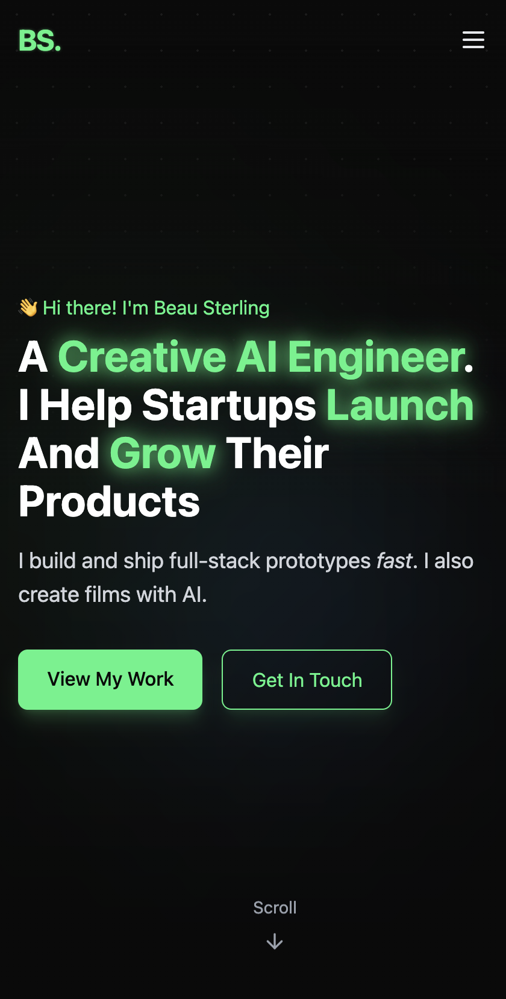
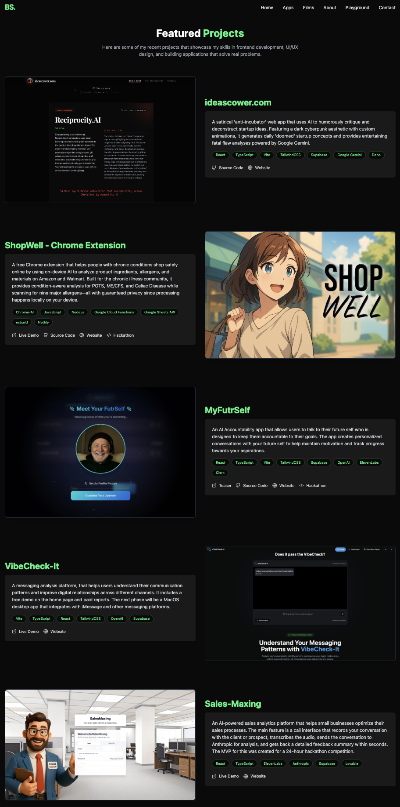
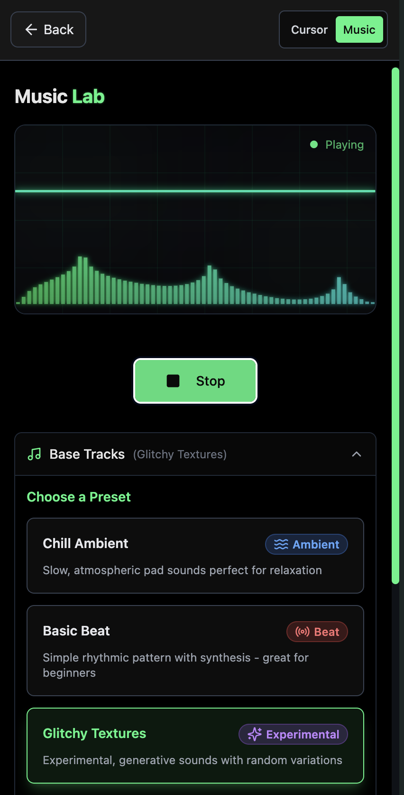

# Beau Sterling - Portfolio

[](https://react.dev/)
[](https://www.typescriptlang.org/)
[](https://vitejs.dev/)
[](https://tailwindcss.com/)
[](https://beausterling.xyz)
[](https://opensource.org/licenses/MIT)

<p align="center">
  
</p>

<p align="center">
  <strong>A Creative AI Engineer helping startups launch and grow their products.</strong><br>
  Full-stack web applications, AI-powered projects, and generative film work.
</p>

<p align="center">
  <a href="https://beausterling.xyz">View Live Site</a>
</p>

---

## Table of Contents

- [Features](#features)
- [Tech Stack](#tech-stack)
- [Featured Projects](#featured-projects)
- [Interactive Playground](#interactive-playground)
- [Installation](#installation)
- [Contact](#contact)
- [License](#license)

---

## Features

- **Full-Stack Portfolio** - Showcases web applications and AI-powered projects
- **Interactive Playground** - Cursor effects and music lab experiments
- **AI Film Showcase** - Generative video work using Veo, Suno AI, ElevenLabs, and more
- **Contact Form** - Integrated with Supabase edge functions
- **Dark Cyberpunk Design** - Responsive UI with custom animations and neon accents

---

## Tech Stack

| Category | Technologies |
|----------|-------------|
| **Frontend** | React 18, TypeScript, Tailwind CSS, shadcn/ui |
| **Build** | Vite with SWC |
| **Backend** | Supabase (PostgreSQL, Edge Functions) |
| **AI APIs** | OpenAI, Anthropic Claude, Google Gemini, ElevenLabs |
| **Deployment** | Netlify |

---

## Featured Projects

<p align="center">
  
</p>

### [ideascower.com](https://ideascower.com)
Satirical "anti-incubator" that uses Google Gemini to roast startup ideas. Dark cyberpunk UI with custom animations. Parody of ideabrowser.com.

### [ShopWell Chrome Extension](https://shopwell-extension.com)
Privacy-first shopping assistant for people with chronic conditions. Uses Chrome's on-device AI to analyze ingredients and allergens on Amazon/Walmart without sending data to external servers.

### [MyFutrSelf](https://myfutrself.com)
AI accountability app where you talk to your future self. Built with OpenAI + ElevenLabs for voice synthesis.

### [VibeCheck-It](https://vibecheckit.com)
Messaging analysis platform that helps users understand their communication patterns. Free demo on homepage, paid reports available.

### [Sales-Maxing](https://sales-maxing.lovable.app)
Sales call analyzer - records conversations, transcribes via ElevenLabs, analyzes with Anthropic's Claude, returns feedback in seconds. Built in 24 hours for a hackathon.

### [Moon Rhythms](https://moonrhythms.io)
Personal astrology app syncing self-care routines with lunar cycles *(in development)*.

---

## Interactive Playground

The site includes an interactive playground at `/playground` with:

- **Cursor Effects** - Visual cursor trail experiments and animations
- **Music Lab** - Audio generation and manipulation tools with presets

<p align="center">
  
</p>

---

## Installation

### Prerequisites

- Node.js 18+
- npm or yarn

### Setup

```bash
# Clone the repository
git clone https://github.com/beausterling/beau-sterling-portfolio.git

# Navigate to project directory
cd beau-sterling-portfolio

# Install dependencies
npm install

# Set up environment variables
cp .env.example .env
# Add your Supabase credentials to .env

# Start development server
npm run dev
```

The site will be available at `http://localhost:8080`

---

## Contact

- **Email:** [beaujsterling@gmail.com](mailto:beaujsterling@gmail.com)
- **GitHub:** [@beausterling](https://github.com/beausterling)
- **LinkedIn:** [beausterling](https://linkedin.com/in/beausterling)

Or use the contact form on the [live site](https://beausterling.xyz).

---

## License

This project is licensed under the MIT License - see the [LICENSE](LICENSE) file for details.
